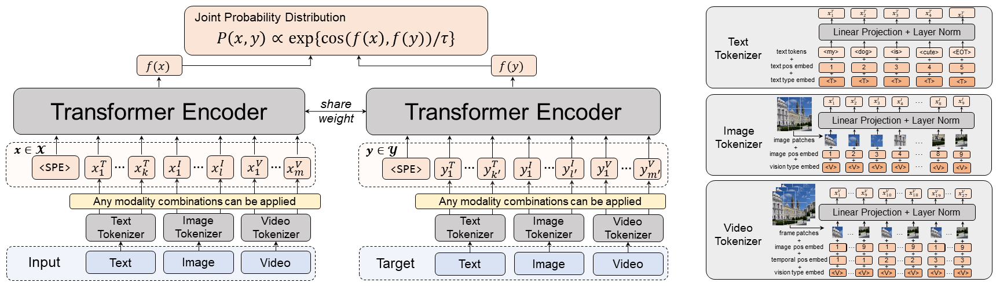
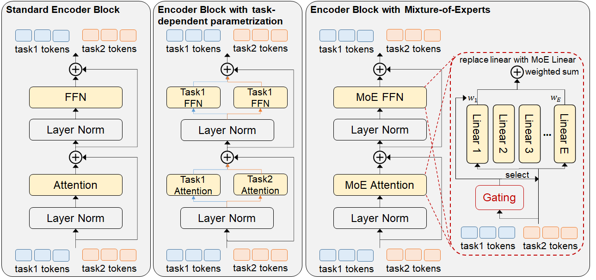

# Uni-Perceiver

This repository contains training (pre-training, fine-tuning, prompt-tuning), evaluation code and pretrained models for the following papers:


> [Uni-Perceiver](https://arxiv.org/abs/2112.01522): Pre-training Unified Architecture for Generic Perception for Zero-shot and Few-shot Tasks, CVPR 2022.

> [Uni-Perceiver-MoE](https://arxiv.org/abs/2206.04674): Learning Sparse Generalist Models with Conditional MoEs, NeurIPS 2022.


## Introduction

__Uni-Perceiver__ is a generalist model (generic perception model) that can process a variety of modalities and tasks with unified modeling and shared
parameters. Different perception tasks are modeled as the same formulation, that is, finding the maximum likelihood target for each input through the similarity of their representations. Meanwhile,  Uni-Perceiver is pre-trained on several uni-modal and multi-modal tasks, and evaluated on a variety of downstream tasks, including novel tasks that did not appear in the pre-training stage.
Thanks to the unified formulation, it shows the ability of zero-shot inference on novel tasks, and shows promising performance close to or on par with SOTA results by prompt tuning or finetuning.



In __Uni-Perceiver-MoE__, we found that the interference among different tasks and modalities can lead to performance degradation of generalist models on some tasks compared with task-specialized models. We introduce the Conditional Mixture-of-Experts (Conditional MoEs) to mitigate such interference. By incorporating the proposed Conditional MoEs, Uni-Perceiver-MoE can effectively mitigate the interference across tasks and modalities, and achieves state-of-the-art results on a series of downstream tasks via prompt tuning on 1% of downstream data. Moreover, the introduction of Conditional MoEs still holds the generalization ability of generalist models to conduct zero-shot inference on new tasks,




## Main Results and Pretrained Models

### Base Models

<table border="1" width="100%">
  <tr align="center">
    <th>Task</th>
    <th>Image Classification</th>
    <th colspan="2">Image Caption</th>
    <th colspan="4">Image Retrieval</th>
    <th>Video Classification</th><th>Video Caption</th><th colspan="2">Video Retrieval</th>
  </tr>
  <tr align="center">
    <td>Dataset</td><td>ImageNet-1k</td><td>MSCOCO</td><td>Flickr30k</td><td colspan="2">MSCOCO</td><td colspan="2">Flickr30k</td><td>Kinetics-400</td><td>MSVD</td><td colspan="2">MSVD</td>
  </tr>
  <tr align="center">
    <td>Split</td><td>ILSVRC 2012 val</td><td>Karpathy test</td><td>test</td><td colspan="2">Karpathy test</td><td colspan="2">test</td><td>test-dev</td><td>val</td><td>val</td><td colspan="2">val</td>
  </tr>
  <tr align="center">
    <td>Metric</td><td>Acc@1</td><td>BLEU-4</td><td>BLEU-4</td><td>R@1 i2t</td><td>R@1 t2i</td><td>R@1 i2t</td><td>R@1 t2i</td><td>Acc@1</td><td>BLEU-4</td><td>R@1 v2t</td><td>R@1 t2v</td>
  </tr>
  </tr>
  <tr align="center">
    <td>Uni-Perceiver<sub>BASE</sub> w/o Tuning</td><td>79.2 </td><td>32.0</td><td>14.7 </td><td>64.9 </td><td>50.7 </td><td>82.3 </td><td>71.1</td> <td>74.5 </td><td>22.6 </td><td>50.3</td><td>38.7 </td>
  </tr>
  <tr align="center">
    <td>Uni-Perceiver<sub>BASE</sub> PT (1%)</td><td>80.9 </td><td>35.5</td><td>30.2</td><td>68.4 </td><td>51.9 </td><td>91.0 </td><td>76.0 </td><td>74.8 </td><td>59.5 </td><td>62.7 </td><td>43.8 </td>
  </tr>
   <tr align="center">
    <td>Uni-Perceiver<sub>BASE</sub> FT (100%)</td><td>84.0</td><td>36.4 </td><td>31.2 </td><td>69.8</td><td>53.9 </td><td>92.7</td><td>77.5</td><td>77.7 </td><td>63.3 </td><td>62.8</td><td>45.8 </td>
  </tr>

  <tr align="center">
    <td>Uni-Perceiver-MoE<sub>BASE</sub> w/o Tuning</td><td>80.3 </td><td>33.2</td><td>15.9 </td><td>64.6 </td><td>51.6 </td><td>82.1 </td><td>75.8</td> <td>76.8 </td><td>23.4 </td><td>52.8</td><td>40.0 </td>
  </tr>
  <tr align="center">
    <td>Uni-Perceiver-MoE<sub>BASE</sub> PT (1%)</td><td>82.0 </td><td>36.8</td><td>30.7</td><td>68.9 </td><td>52.6 </td><td>91.3 </td><td>78.5 </td><td>77.2 </td><td>60.0 </td><td>65.6 </td><td>45.3 </td>
  </tr>
   <tr align="center">
    <td>Uni-Perceiver-MoE<sub>BASE</sub> FT (100%)</td><td>84.5</td><td>37.3 </td><td>32.4 </td><td>70.5</td><td>54.1 </td><td>93.6</td><td>79.8</td><td>79.3 </td><td>65.4 </td><td>65.0</td><td>47.8 </td>
  </tr>
</table>


### Large Models

<table border="1" width="100%">
  <tr align="center">
    <th>Task</th>
    <th>Image Classification</th>
    <th colspan="2">Image Caption</th>
    <th colspan="4">Image Retrieval</th>
    <th>Video Classification</th><th>Video Caption</th><th colspan="2">Video Retrieval</th>
  </tr>
  <tr align="center">
    <td>Dataset</td><td>ImageNet-1k</td><td>MSCOCO</td><td>Flickr30k</td><td colspan="2">MSCOCO</td><td colspan="2">Flickr30k</td><td>Kinetics-400</td><td>MSVD</td><td colspan="2">MSVD</td>
  </tr>
  <tr align="center">
    <td>Split</td><td>ILSVRC 2012 val</td><td>Karpathy test</td><td>test</td><td colspan="2">Karpathy test</td><td colspan="2">test</td><td>test-dev</td><td>val</td><td>val</td><td colspan="2">val</td>
  </tr>
  <tr align="center">
    <td>Metric</td><td>Acc@1</td><td>BLEU-4</td><td>BLEU-4</td><td>R@1 i2t</td><td>R@1 t2i</td><td>R@1 i2t</td><td>R@1 t2i</td><td>Acc@1</td><td>BLEU-4</td><td>R@1 v2t</td><td>R@1 t2v</td>
  </tr>
  <tr align="center">
    <td>Uni-Perceiver<sub>LARGE</sub> w/o Tuning</td><td>82.7 </td><td> 35.3 </td><td> 15.1 </td><td>67.8 </td><td>54.1 </td><td> 83.7</td><td> 74.2 </td><td> 79.5</td><td>24.7 </td><td> 45.4 </td><td>34.2 </td>
  </tr>
  <tr align="center">
    <td>Uni-Perceiver<sub>LARGE</sub> PT (1%)</td><td>84.2 </td><td>38.6 </td><td> 32.9</td><td> 73.3 </td><td>56.2 </td><td>92.1 </td><td> 80.0</td><td> 80.0</td><td> 67.2</td><td> 65.5 </td><td>48.6 </td>
  </tr>
   <tr align="center">
    <td>Uni-Perceiver<sub>LARGE</sub> FT (100%)</td><td>86.2 </td><td> 39.2 </td><td> 35.5 </td><td>74.4 </td><td>57.9 </td><td>94.7 </td><td> 82.1</td><td>81.9 </td><td>68.3 </td><td> 65.2 </td><td>50.8 </td>
  </tr>

  <tr align="center">
    <td>Uni-Perceiver-MoE<sub>LARGE</sub> w/o Tuning</td><td>83.4 </td><td> 35.5 </td><td> 15.8 </td><td>67.9 </td><td>55.3 </td><td> 83.6</td><td> 75.9 </td><td> 82.1</td><td>24.6 </td><td> 45.7 </td><td>41.9 </td>
  </tr>
  <tr align="center">
    <td>Uni-Perceiver-MoE<sub>LARGE</sub> PT (1%)</td><td>84.9 </td><td>39.3 </td><td> 33.7</td><td> 73.3 </td><td>57.1 </td><td>92.4 </td><td> 80.6</td><td> 83.0</td><td> 67.6</td><td> 66.4 </td><td>50.3 </td>
  </tr>
   <tr align="center">
    <td>Uni-Perceiver-MoE<sub>LARGE</sub> FT (100%)</td><td>86.4 </td><td> 40.5 </td><td> 36.2 </td><td>74.7 </td><td>58.3 </td><td>94.1 </td><td> 83.7</td><td>84.2 </td><td>68.9 </td><td> 67.6 </td><td>52.3 </td>
  </tr>
</table>

  * The numbers are slightly better than the original paper of Uni-Perceiver, which are from the reproduced version of Uni-Perceiver used as the baseline of [Uni-Perceiver-MoE](https://arxiv.org/abs/2206.04674).
  * The image resolution for all tasks is `224x224`.
  * See [OtherResults.md](data/other_results.md) for results on more tasks and datasets.


## Usage
### Requirements
* Linux, CUDA>=10.1, GCC>=5.4

* Python >=3.7

* pytorch >= 1.8.0 

* JAVA >= 1.8 (for caption task evaluation)


### Installation
```bash
git clone https://github.com/fundamentalvision/Uni-Perceiver
cd Uni-Perceiver
pip install -r requirements.txt
```


### Data
See [prepare_data.md](data/prepare_data.md).

### Pre-trained Model Weights
See [checkpoints.md](data/checkpoints.md).


### Pre-training 
See [pretraining.md](data/pretraining.md).

### Fine-tuning 
See [finetuning.md](data/finetuning.md).

###  Prompt-tuning

See [prompt_tuning.md](data/prompt_tuning.md).


###  Inference

See [inference.md](data/inference.md).

### TODO 

* release more pretrained models
  - [ ]  Uni-Perceiver Tiny model
  - [ ]  Uni-Perceiver Small model
  - [ ]  Uni-Perceiver Huge model

* support more datasets and tasks


## License
Uni-Perceiver is licensed under the [Apache-2.0 License](./LICENSE).


<br></br>

## Citing Uni-Perceiver
If you find Uni-Perceiver useful in your research, please consider giving a star ⭐ and citing:
```bibtex
 @article{zhu2021uni,
  title={Uni-Perceiver: Pre-training Unified Architecture for Generic Perception for Zero-shot and Few-shot Tasks},
  author={Zhu, Xizhou and Zhu, Jinguo and Li, Hao and Wu, Xiaoshi and Wang, Xiaogang and Li, Hongsheng and Wang, Xiaohua and Dai, Jifeng},
  journal={arXiv preprint arXiv:2112.01522},
  year={2021}

}
```

```bibtex
@article{zhu2022uni,
  title={Uni-Perceiver-MoE: Learning Sparse Generalist Models with Conditional MoEs},
  author={Zhu, Jinguo and Zhu, Xizhou and Wang, Wenhai and Wang, Xiaohua and Li, Hongsheng and Wang, Xiaogang and Dai, Jifeng},
  journal={arXiv preprint arXiv:2206.04674},
  year={2022}
}
```

### Acknowledgements
Many thanks to following codes that help us a lot in building this codebase:
* [Detectron2](https://github.com/facebookresearch/detectron2)
* [X-modaler](https://github.com/YehLi/xmodaler)
* [deit](https://github.com/facebookresearch/deit)
* [VL-BERT](https://github.com/jackroos/VL-BERT)
* [TimeSformer](https://github.com/facebookresearch/TimeSformer)
* [CLIP](https://github.com/openai/CLIP)
